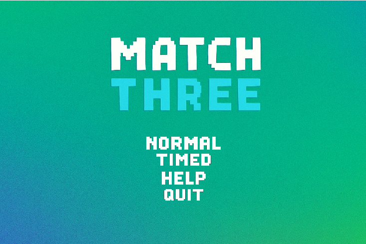

# Match-Three Game



## 🚀 Quick Start

1. **Download the Game:**
	- Download Match-3 Download.zip
2. **Extract the Zip:**
	- Right-click the downloaded zip and select **Extract All...**
3. **Run the Game:**
	- Open the extracted folder and double-click `game-normal.exe` to play!

> **No installation or setup required. All dependencies and assets are included in the zip.**

---

## Download and Play

For most users, the easiest way to play is to download the pre-packaged zip:

- [⬇️ Download Match-3 Download.zip](https://github.com/muneeb-anjum0/Match-Three/raw/master/Match-3%20Download.zip)
	- Extract and run `game-normal.exe` inside the folder.

Alternatively, you can download just the executable:

- [⬇️ Download game-normal.exe](https://github.com/muneeb-anjum0/Match-Three/raw/master/game-normal.exe)
	- Make sure all DLLs and the `assets/` folder are present in the same directory.

## Table of Contents

- [Quick Start](#-quick-start)
- [Overview](#overview)
- [Features](#features)
- [Technologies & Libraries](#technologies--libraries)
- [Project Structure](#project-structure)
- [Build & Run Instructions](#build--run-instructions)
- [Assets](#assets)
- [License](#license)

---
## Build & Run Instructions (For Developers)

If you want to build the game from source or modify the code:

- [Overview](#overview)
- [Features](#features)
- [Technologies & Libraries](#technologies--libraries)
- [Project Structure](#project-structure)
- [Build & Run Instructions](#build--run-instructions)
- [Assets](#assets)
- [License](#license)

---

## Overview

**Match-Three** is a classic tile-matching puzzle game built in C++ using the SFML library. The game features a polished UI, smooth animations, sound effects, and multiple game modes. Players swap adjacent tiles to match three or more of the same type, earning points and progressing through levels.

---

## Features

- **Multiple Game Modes:**  
	- Normal mode with progressive levels  
	- Timed mode with countdown timer

- **Animated Tile Swaps:**  
	- Smooth transitions and easing for tile movements

- **Progress Bars:**  
	- Track collection of different species with animated progress bars

- **Sound & Music:**  
	- Background music for menus and gameplay  
	- Sound effects for clicks, matches, invalid moves, navigation, level up, and game over

- **Help & Instructions:**  
	- In-game help screen with rules and instructions

- **Game Over & Win Screens:**  
	- Custom screens for game completion, including final score and winning species

- **Responsive UI:**  
	- Scaled sprites and centered buttons for a modern look

---

## Technologies & Libraries

### Programming Language

- **C++17**  
	- Modern C++ features for performance and maintainability

### Graphics & Audio

- **SFML (Simple and Fast Multimedia Library)**  
	- `Graphics`: Rendering windows, sprites, textures, and text  
	- `Audio`: Playing music and sound effects  
	- `Window`: Handling events and user input  
	- `System`: Timing, clocks, and utility functions

	*SFML is used extensively for all rendering, input, and multimedia needs. See [`dependencies.h`](dependencies.h) for all SFML includes.*

### Build System

- **Makefile**  
	- Custom Makefile for Windows (MinGW)  
	- Handles compilation, linking, cleaning, and running the game

- **Batch Script**  
	- `build_and_run.bat` for easy build and launch via double-click

- **VS Code Tasks**  
	- Integrated build tasks for compiling with g++ via MSYS2

### Asset Management

- **Custom Asset Folders**  
	- Organized structure for textures, audio, and fonts

### Other Libraries

- **Standard C++ Libraries**  
	- `<cmath>`, `<iostream>`, `<time.h>`, etc.

---

## Project Structure

```
Match3/
├── assets/
│   ├── audio/        # Game music and sound effects (.ogg)
│   ├── font/         # Game fonts (.ttf, .otf)
│   └── textures/     # Sprites, backgrounds, buttons (.png)
├── main.cpp          # Main game logic and UI
├── dependencies.h    # All includes, helper functions, and asset loaders
├── Makefile          # Build instructions for Windows
├── build_and_run.bat # Batch script for building and running
├── LICENSE           # MIT License
├── README.md         # Project documentation
└── ...               # DLLs, object files, and other build artifacts
```

---

### Prerequisites

- **Windows OS**
- **MinGW/MSYS2** (g++ compiler)
- **SFML 2.x** (pre-built binaries and headers)

### Steps

1. **Clone or Download the Repository:**
	- Download as zip or use `git clone https://github.com/muneeb-anjum0/Match-Three.git`
2. **Install SFML:**
	- Download and build SFML for Windows. Place the `include` and `lib` folders as referenced in the Makefile.
3. **Build the Game:**
	- Double-click `build_and_run.bat`  
	- Or open a terminal in the project folder and run:
	  ```powershell
	  make clean; make; make run
	  ```
4. **Run the Executable:**
	- The game will launch as `game-normal.exe` in the project root.

### Troubleshooting

- Ensure all required DLLs (SFML, GCC, etc.) are present in the root directory.
- If you encounter missing DLL errors, copy the relevant files from your SFML and MinGW installation.

---

## Assets

- **Textures:**  
	- Sprites for animals, backgrounds, buttons, progress bars

- **Audio:**  
	- 8-bit style music and sound effects for all game events

- **Fonts:**  
	- Digital-style fonts for UI and score display

*All assets are located in the `assets/` folder and loaded at runtime.*

---

## License

This project is licensed under the MIT License. See [`LICENSE`](LICENSE) for details.

---

## Credits

- **SFML**: [https://www.sfml-dev.org/](https://www.sfml-dev.org/)
- **Music & Sound Effects**: Various open-source and chiptune sources (see `assets/audio/`)
- **Fonts**: Digitalt font (see `assets/font/`)

---

*For any questions or contributions, feel free to open an issue or pull request.*

---
